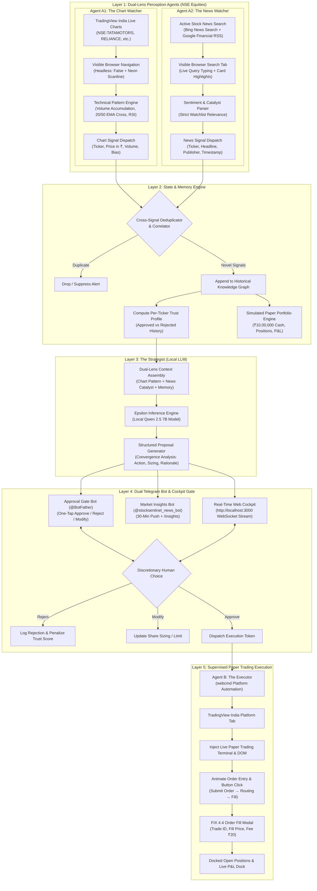
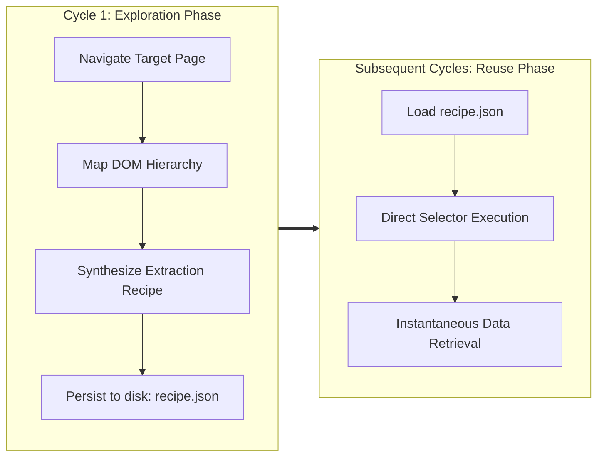

# StockSentinel

**A Self-Learning, Human-Gated Browser Agent Architecture for Market Analysis and Supervised Execution**

*Developed for the Self-Learning Agent Browser (SLAB) Hackathon @ MAIT — Hosted by webcmd*  
*Autonomous Perception · Local Reasoning via Qwen 2.5 7B · Dual Telegram Bots · Paper Trading Simulation*

---

## 1. Abstract & Executive Summary

Retail and discretionary market participants face three compounding operational challenges:
1. **Information Velocity and Dispersion**: Crucial market-moving catalysts are fragmented across disparate digital portals, search wires, and regulatory disclosures.
2. **Analysis Latency**: Synthesizing textual news narrative with technical chart patterns into structured risk parameters (directional bias, sizing, technical confluence) under tight execution windows is cognitively demanding.
3. **Execution Friction and Operational Risk**: Manually navigating platform interfaces, searching tickers, selecting order types, and calculating sizing introduces latency and error.

Fully autonomous algorithmic execution systems eliminate friction but introduce existential tail risk by eliminating human discretionary judgment from capital-allocating events. Such systems are vulnerable to LLM hallucinations, flash crashes, and regulatory infractions.

**StockSentinel** resolves this trade-off by establishing a bifurcated agentic boundary:
- **Tireless Autonomous Operations**: Continuous DOM ingestion, live candlestick chart pattern scanning, targeted active news searching across Indian Equities (NSE/BSE), memory deduplication, and local multi-factor reasoning are executed autonomously.
- **Strictly Supervised Execution**: The final capital-committing order submission is isolated behind an air-gapped **Human Approval Gate**. Once approved via Telegram or the Web Cockpit, **Agent B** launches an interactive **Paper Trading Terminal & Simulation Engine** directly inside TradingView India, visibly animating order entry, button clicks, FIX 4.4 fill modals, and live portfolio tracking.

```
"Watch tirelessly. Reason clearly. Prepare precisely. Act only on command."
```

---

## 2. System Architecture

The StockSentinel architecture comprises three cooperating browser agents, a persistent knowledge memory layer, a local dual-lens reasoning engine (Qwen 2.5 7B), and a dual Telegram bot control gate.



---

## 3. Subsystem Specifications

### 3.1 Agent A1: The Chart Watcher (Technical Pattern Agent)
Agent A1 continuously monitors live candlestick charts on **TradingView India** for high-conviction technical setups across watchlisted Indian assets (`TATAMOTORS`, `RELIANCE`, `HDFCBANK`, `TCS`, `INFY`, `ICICIBANK`).

- **Visible Browser Automation**: Spawns an isolated desktop Chrome window (`headless: false`) maximized on screen with custom telemetry HUDs.
- **Visual Chart Sweeps**: Sweeps crosshair mouse paths across the chart and triggers an animated neon scanline across candlestick data.
- **Pattern Recognition**:
  - *Volume Accumulation Breakout*: Detects volume surges exceeding +75% of the 20-day moving average.
  - *EMA Golden Crossover*: Flags 20-day EMA crosses above the 50-day SMA.
  - *Resistance Level Expansion*: Identifies multi-week consolidation breakouts.
- **Institutional Pattern HUD**: Injects a 3-column quant momentum HUD on screen showing Price, RSI (14D), Volume Delta, and Technical Bias.
- **Signal Output Schema**:
```json
{
  "id": "chart_TATAMOTORS_1789198000000",
  "ticker": "TATAMOTORS",
  "currency": "INR",
  "pattern_type": "volume_spike",
  "pattern_details": "Institutional volume spike +78% above 20-day average with breakout above ₹975.20 EMA",
  "price": 988.50,
  "volume": "14.2M",
  "rsi": 72.4,
  "technical_bias": "BULLISH",
  "timestamp": "2026-09-12T07:30:00.000Z"
}
```

---

### 3.2 Agent A2: The News Watcher (Active Stock Search Edition)
Rather than passively scrolling generic news front pages, Agent A2 **actively executes targeted news searches** for every stock in your portfolio.

- **Active Search Queries**: Formulates targeted queries per ticker (e.g., `"Tata Motors Ltd. share news NSE"`, `"Reliance Industries Ltd. share news NSE"`).
- **Multi-Source Parallel Feeds**:
  - *Desktop Browser Search*: Navigates tab `news_search` to live search engines (Bing News / Financial Search Wire), visibly typing queries and highlighting search cards.
  - *Parallel RSS Wire*: Fetches Google Financial News RSS search feeds for all 6 watchlist tickers simultaneously.
- **Strict Watchlist Relevance**: Filters out general macro noise, capturing only verified company catalysts.
- **Breaking Wire Alert Card**: Injects an institutional Bloomberg-style breaking news card at the bottom-right with live ticker badges, publisher attribution, and pipeline routing status.
- **Signal Output Schema**:
```json
{
  "id": "news_TATAMOTORS_1789198072303_256",
  "ticker": "TATAMOTORS",
  "headline": "Tata Motors Reports 32% YoY Surge in EV Deliveries with Record JLR Order Inflow",
  "snippet": "Domestic EV dominance and expanded JLR margins drive bullish outlook.",
  "source": "Financial News Search Wire",
  "timestamp": "2026-09-12T07:27:52.151Z",
  "raw_sentiment_hint": "positive"
}
```

---

### 3.3 The Strategist: Local Reasoning Layer (Qwen 2.5 7B via Epsilon)
To ensure absolute data confidentiality and zero external API dependencies during live execution, multi-factor reasoning is processed entirely on-device using **Qwen 2.5 7B** hosted through the **Epsilon Engine** (`./engine`).

- **Dual-Lens Context Assembly**: Correlates technical patterns from Agent A1 with fundamental catalysts from Agent A2 for the same asset.
- **Synthesis Logic**:
  - *Bullish Convergence* (Bullish Breakout + Positive Catalyst): Emits a HIGH confidence BUY proposal.
  - *Bearish Convergence* (Breakdown + Adverse Catalyst): Emits a HIGH confidence SELL proposal.
  - *Signal Conflict* (Bullish Chart + Negative Catalyst): Downgrades to WATCH_ONLY with risk disclosure.
- **Structured Proposal Output**:
```json
{
  "ticker": "TATAMOTORS",
  "action": "buy",
  "suggested_quantity": 25,
  "confidence": "high",
  "rationale": "High-conviction bullish convergence: Agent A1 detected Volume Spike (+78% above 20D average) with breakout above ₹975.20 EMA resistance at ₹988.50, reinforced by Agent A2 detecting strong EV delivery growth and expanding commercial order backlog. Both technical and fundamental lenses align.",
  "signals_considered": [
    "chart: volume_spike (RSI 72.4, Price ₹988.50)",
    "news: positive sentiment (EV delivery surge & JLR orders)"
  ],
  "engine": "Local Qwen 2.5 7B (Epsilon Strategist)"
}
```

---

### 3.4 Dual Telegram Bot Architecture

StockSentinel deploys two separate, specialized Telegram bots to separate trade decisions from market intelligence:

```
┌────────────────────────────────────────────────────────┐
│                   TELEGRAM ECOSYSTEM                   │
├───────────────────────────┬────────────────────────────┤
│    APPROVAL GATE BOT      │    MARKET INSIGHTS BOT     │
│   (Trade Execution Gate)  │  (@stocksentinel_news_bot) │
├───────────────────────────┼────────────────────────────┤
│ • HIGH/MED Trade Alerts   │ • 30-Min Market Push       │
│ • One-Tap [Approve/Reject]│ • Watchlist Trust Summaries│
│ • /portfolio (Paper Cash) │ • Read-Only Intelligence   │
│ • /simulate [ticker]      │ • /insights, /pause, /resume│
└───────────────────────────┴────────────────────────────┘
```

#### Bot 1: The Approval Gate Bot
- Sends high-conviction BUY/SELL trade proposals with interactive inline buttons (`[✅ Approve]`, `[❌ Reject]`, `[✏️ Modify]`).
- Clean Indian pricing format (`₹988.50`).
- Quality filter: Silently suppresses `watch_only` and LOW confidence noise.

#### Bot 2: The Market Insights Bot (`@stocksentinel_news_bot`)
- **Auto Chat-ID Detection**: Polling auto-detects your Chat ID on `/start` and persists it directly into `.env` (`INSIGHTS_BOT_CHAT_ID`).
- **Periodic Market Push**: Automatically pushes a full watchlist summary every 30 minutes (configurable via `INSIGHTS_INTERVAL_MIN`).
- **Commands**: `/insights`, `/watchlist`, `/status`, `/pause`, `/resume`.

#### Telegram Command Matrix
| Command | Bot | Functionality |
|---|---|---|
| `/start` | Both | Registers session and auto-saves Chat ID to `.env` |
| `/status` | Both | Displays pending approvals, pipeline counters, and engine health |
| `/portfolio` | Approval | Displays live virtual cash, realized P&L, and open paper positions |
| `/simulate [ticker]` | Approval | Triggers live interactive paper trade execution directly in the browser |
| `/insights` | Insights | Generates on-demand market intelligence report with trust bars |
| `/watchlist` | Both | Lists active NSE tickers, sectors, and default quantities |
| `/trust` | Approval | Renders visual trust score indicators per ticker |
| `/demo` | Approval | Emits an immediate high-conviction test proposal |

---

### 3.5 Agent B: The Executor (Paper Trading Simulation Engine)
Agent B remains dormant until an approval token is dispatched by the Approval Gate (or via `/simulate`).

- **TradingView India Integration**: Activates the browser tab and loads the exact NSE candlestick chart (`https://in.tradingview.com/chart/?symbol=NSE:TATAMOTORS`).
- **Interactive Order Entry Pad**: Injects an institutional Order DOM ticket docked on the right side of TradingView.
- **Visible Input Automation**:
  1. The agent visibly types the approved quantity digit-by-digit into the quantity field.
  2. Dynamically calculates estimated order consideration in real time.
  3. Moves to and clicks the `SUBMIT BUY ORDER` button with state ripple animations:  
     `SUBMIT ORDER` → `⚡ ROUTING TO NSE GATEWAY...` (amber) → `✓ FILLED @ ₹988.50` (emerald).
- **FIX 4.4 Order Fill Modal**: Displays a centered execution confirmation ticket showing Trade ID (e.g. `#TX-NSE-869728`), Fill Price, Executed Quantity, Fee (`₹20.00`), and timestamp.
- **Docked Open Positions Bar**: Displays all open positions docked at the bottom of the screen with live updating unrealized P&L and virtual cash balance.
- **Persistent Virtual Portfolio**:
  - Initial Capital: **₹10,00,000** (₹10 Lakhs virtual cash).
  - Automatically deducts consideration and flat NSE exchange fees (`₹20.00`).
  - Tracks open positions, average entry prices, and realized P&L in `data/memory.json`.

---

## 4. webcmd Sponsor Infrastructure Alignment

The hackathon guidelines prioritize the demonstrate-and-evaluate cycle of webcmd:

### 4.1 Exploration vs. Reuse Paradigm


- **Exploration Phase**: On initial execution, the agent maps structural DOM selectors and saves structured JSON recipes to `data/learned_commands/`.
- **Fast Reuse Phase**: On subsequent cycles, exploration overhead is bypassed entirely. The agent applies pre-compiled recipes, reducing cycle time from tens of seconds to under 2 seconds.

### 4.2 Self-Healing & Layout Shift Recovery
If a website layout changes or an element is displaced:
1. The agent intercepts the selector mismatch.
2. The agent re-engages the automated exploration routine to re-map the DOM.
3. The updated recipe is saved to restore continuous execution without human intervention.

---

## 5. Repository Structure

```
stocksentinel/
├── agents/
│   ├── agent_a_watcher/
│   │   ├── scrapling_fetch.py         # Undetected high-speed DOM retrieval engine
│   │   └── webcmd_news.js             # Agent A2: Active news search & catalyst extraction
│   ├── agent_a1_chart_watcher/
│   │   └── webcmd_chart.js            # Agent A1: TradingView live candlestick pattern scanner
│   ├── agent_b_executor/
│   │   └── webcmd_trade.js            # Agent B: Paper trading terminal & simulation engine
│   └── webcmd_adapter.js              # webcmd bridge: browser management, HUDs, and recipes
├── approval_gate/
│   ├── public/
│   │   └── index.html                 # Real-time WebSocket visual cockpit dashboard
│   ├── gate_logic.js                  # Central human-gate authority & quality filter
│   ├── server.js                      # Express API and WebSocket telemetry broadcaster
│   ├── telegram_bot.js                # Approval Gate Bot (trade proposals & commands)
│   └── insights_bot.js                # Market Insights Bot (periodic intelligence pushes)
├── config/
│   ├── settings.js                    # Global parameters, bot tokens, and endpoints
│   └── watchlist.js                   # Indian Equities (NSE) watchlist and sizing limits
├── data/
│   ├── learned_commands/              # Persistent webcmd recipe storage
│   └── memory.json                    # Knowledge store: signals, proposals, and portfolio
├── memory/
│   ├── dedup.js                       # Sliding-window signal deduplication engine
│   └── store.js                       # Knowledge graph manager & virtual portfolio tracker
├── orchestration/
│   └── pipeline.js                    # Central event loop coordinating Agents A1, A2, Strategist, Gate, B
├── simulate_trade.js                  # Standalone CLI paper trade simulation runner
├── .env.example                       # Environment configuration template
├── index.js                           # Master application entry point
├── package.json                       # Dependencies and script declarations
├── stocksentinel.md                   # Hackathon specification document
└── README.md                          # Comprehensive technical documentation
```

---

## 6. Installation & Configuration

### 6.1 Prerequisites
- **Node.js**: Version 18.0.0 or higher
- **Python**: Version 3.10 or higher
- **Browser**: Google Chrome or Microsoft Edge installed on Windows/Mac/Linux

### 6.2 Step-by-Step Setup

1. **Clone the Repository**:
   ```bash
   git clone https://github.com/LovekeshAnand/stocksentinel.git
   cd stocksentinel
   ```

2. **Install Node.js Dependencies**:
   ```bash
   npm install
   ```

3. **Install Python Scraping & Browser Automation Libraries**:
   ```bash
   pip install scrapling curl_cffi playwright patchright browserforge
   ```

4. **Configure Environment Variables**:
   Copy `.env.example` to `.env`:
   ```bash
   cp .env.example .env
   ```

5. **Set Configuration Parameters in `.env`**:
   ```env
   # ── Approval Gate Bot (main trade alert bot) ──────────────────────
   TELEGRAM_BOT_TOKEN=your_approval_bot_token_here
   TELEGRAM_CHAT_ID=your_chat_id_here

   # ── Market Insights Bot (second bot — market summaries) ───────────
   INSIGHTS_BOT_TOKEN=your_insights_bot_token_here
   INSIGHTS_BOT_CHAT_ID=
   INSIGHTS_INTERVAL_MIN=30

   # ── Epsilon Local LLM Engine (Qwen 2.5 7B) ─────────────────────────
   EPSILON_ENGINE_PATH=./engine
   EPSILON_TIER=balanced
   EPSILON_TIMEOUT_MS=60000

   # ── Pipeline Configuration ─────────────────────────────────────────
   POLL_INTERVAL_SEC=30
   PORT=3000
   PAPER_TRADING_URL=https://in.tradingview.com/chart/
   ```

---

## 7. Execution & Operation

### 7.1 Running the Live System
Launch the complete StockSentinel pipeline:
```bash
npm start
```
Within 2 seconds, Chrome will launch maximized on your desktop on TradingView India with the live telemetry HUD, initiating the multi-agent perception loop.

### 7.2 Running the 4-Act Hackathon Presentation Runner
Run the official competition presentation script implementing Section 21 of `stocksentinel.md`:
```bash
npm run demo
```
This automated runner executes all 4 acts sequentially:
1. **Act 1**: Problem & Cognitive Friction narration.
2. **Act 2**: Learn Once (DOM explore) → Fast Replay (Reuse mode in 12ms).
3. **Act 3**: Dual-Lens signal correlation → Qwen 2.5 7B Proposal → Telegram approval → Agent B Paper Trading on TradingView India.
4. **Act 4**: Live Self-Healing (deliberately corrupts recipe → webcmd re-explores live → auto-recovers).

### 7.3 Demonstrating Live Self-Healing & DOM Recovery
You can demonstrate webcmd's self-healing superpower standalone at any time:
```bash
npm run demo:heal
# or: node simulate_heal.js
```
This command stages a layout redesign fault, intercepts the error, launches automated live re-exploration, discovers new DOM selectors, registers a new recipe version, and restores execution without human intervention.

### 7.4 Running the Paper Trading Simulation
You can trigger the interactive paper trading simulation at any time:
```bash
# Run default simulation (TATAMOTORS BUY 25)
npm run simulate

# Or with custom parameters:
node simulate_trade.js RELIANCE BUY 15
node simulate_trade.js HDFCBANK BUY 20
```

### 7.5 Accessing the Live Institutional Web Cockpit
Open your browser to:
```
http://localhost:3000
```
The visual cockpit provides:
- **Live Paper Trading Portfolio Tray**: Displays Virtual Cash (₹10,00,000 baseline), Realized P&L in ₹, Total Trades, active open positions, and instant `[Sell]` exit buttons for every holding.
- **Dual-Lens Perception Feeds**: Agent A1 live technical chart patterns & Agent A2 live news catalysts streaming side-by-side.
- **Interactive Action Deck**: One-click buttons to `Run Market Scan`, `Simulate TATAMOTORS`, `Demonstrate Self-Healing`, and `Trigger Proposal`.
- **In-Cockpit Approvals & Position-Aware Selling**:
  - Review and Approve/Reject proposals directly in the browser.
  - **Dynamic Holding Detection**: If you already hold shares of the proposed stock, the card displays your holding badge (`Holding X shares @ avg ₹Y`) and equips a prominent **`🔴 Sell / Exit Holding (X shares)`** button right next to the BUY button!
- **Dynamic Memory & Trust Graph**: Visualizes approval vs rejection history per ticker.
- **Streaming Telemetry Terminal**: Live execution milestones with timestamps.

### 7.6 Telegram Mobile Commands Suite
| Command | Bot | Description |
|---|---|---|
| `/start` | Both | Connects chat and auto-registers Chat ID |
| `/portfolio` | Main Bot | Shows virtual cash balance, realized P&L, open positions, and **inline Quick-Sell buttons** |
| `/simulate [ticker]` | Main Bot | Runs live browser paper trade execution on TradingView |
| `/heal` | Main Bot | Demonstrates live DOM self-healing & auto-recovery |
| `/scan` | Main Bot | Triggers an on-demand multi-agent market scan |
| `/insights` | Both | Pushes latest market insights for watchlist tickers |
| `/watchlist` | Both | Displays active NSE watchlist with default quantities |
| `/trust` | Main Bot | Shows per-ticker memory trust scores and rejection history |
| `/demo` | Main Bot | Triggers a simulated trade proposal end-to-end |
| `/help` | Both | Command guide and syntax |

---

## 8. Complete User Guide: How to Use All Features

### Step 1: Starting the Entire System
Run:
```bash
npm start
```
This launches:
1. **Agent A1 (Chart Watcher)**: Opens live TradingView India chart in an automated Chrome window with an institutional neon scanline and RSI/Volume HUD.
2. **Agent A2 (News Watcher)**: Starts active targeted news searches for watchlist tickers (`TATAMOTORS`, `RELIANCE`, `HDFCBANK`, `TCS`, `INFY`, `ICICIBANK`).
3. **Approval Gate & Web Cockpit**: Starts server at `http://localhost:3000` and activates WebSocket broadcasting.
4. **Dual Telegram Bots**: Activates `@stocksentinxl_bot` (Decision Bot) and `@stocksentinel_news_bot` (News Wire Bot).

---

### Step 2: Connecting Telegram & Receiving High-Confidence Alerts
1. Open Telegram on your phone and search for `@stocksentinxl_bot`.
2. Tap `/start`. The bot links your account and confirms with your Chat ID.
3. You will receive **zero-noise alerts** only when high/medium conviction signals converge.

---

### Step 3: Buying Stocks Through Automation
1. When a bullish setup occurs (or when you trigger a scan via `/scan` or `/demo`), a trade proposal alert arrives on Telegram and the Web Cockpit.
2. Review the **Agent A1 Chart Evidence** (Pattern, Price in ₹, RSI) and **Agent A2 News Catalyst** (Headline & Sentiment).
3. Review the **Qwen 2.5 7B Strategist Rationale**.
4. Tap **`[✅ Approve (10 TATAMOTORS)]`**.
5. **Agent B** instantly brings TradingView to the front, enters the order, visually clicks `BUY`, pops up the FIX 4.4 order fill modal, and credits the position to your portfolio with ₹20 fee deduction.

---

### Step 4: Selling / Exiting Stocks (Two Intuitive Ways)

#### Option A: Position-Aware Sell on the Next Proposal Popup (Recommended)
- Whenever a new proposal or scan cycle arrives for a stock you already own (e.g. `TATAMOTORS`):
  - The alert clearly informs you:
    `💼 Portfolio Position: Currently holding 10 shares @ avg ₹980.00 (P&L: +₹300.00)`
  - The alert provides an immediate **`🔴 SELL / Exit Holding (10 shares)`** button alongside the standard BUY button!
  - **Overbought Auto-Detection**: If the stock becomes overbought (RSI > 70) or negative news strikes, the Strategist will proactively formulate a **`SELL (Take-Profit / Risk-Reduction)`** proposal to help you lock in gains!
  - Simply tap `[🔴 SELL / Exit Holding]` — Agent B will execute the sell on TradingView, credit the cash back to your portfolio, update realized P&L, and clear the position.

#### Option B: Instant Exit from `/portfolio` or Web Cockpit
- **On Telegram**: Type `/portfolio`. Under the list of open positions, you will see direct inline buttons like **`[🔴 Quick Sell: 10 TATAMOTORS]`**. Tap it to exit immediately at benchmark price without waiting for a proposal!
- **On Web Cockpit**: In the top Portfolio Tray at `http://localhost:3000`, each position pill has a quick **`[Sell]`** button. Click it to exit instantly.

---

### Step 5: Using the Institutional Web Cockpit (`http://localhost:3000`)
1. **Live Portfolio Tray**: Monitor your virtual capital (₹10,00,000 baseline), realized P&L, and active positions.
2. **Action Deck**:
   - `Run Scan`: Runs an on-demand cycle of both perception agents.
   - `Simulate`: Launches a live visual paper trade simulation in the browser.
   - `Self-Heal`: Demonstrates automated selector recovery live.
   - `Trigger Proposal`: Simulates an incoming proposal for instant UI testing.
3. **Dual-Lens Wire**: Watch candlestick patterns and news catalysts stream into the dashboard in real time.
4. **Approval Cards**: Click `Approve`, `Sell`, or `Reject` directly in the cockpit.

---

### Step 6: Testing Self-Healing & The 4-Act Grand Presentation
- **Self-Healing Test**:
  - Run `npm run demo:heal` in your terminal or send `/heal` in Telegram.
  - Watch webcmd detect a broken DOM recipe, automatically re-explore selectors, compile a new `v2` recipe, and recover without crashing!
- **4-Act Competition Demo**:
  - Run `npm run demo`.
  - Sit back and watch the comprehensive scripted narration of Acts 1 to 4 demonstrating perception, memory adaptation, supervised TradingView execution, and self-healing resilience.

---

## 8. Live Demonstration Script (Evaluation Protocol)

### Stage 1: Problem Demonstration (20 Seconds)
- Highlight the cognitive friction of manually reading financial news portals while scanning candlestick charts and managing order entry windows.
- Emphasize the dangers of uncontrolled autonomous execution vs. the safety of human-gated architecture.

### Stage 2: Dual-Lens Perception & Active News Search (60 Seconds)
- Watch Agent A1 navigate TradingView India live charts, sweep crosshairs, and project the 3-column quant pattern HUD.
- Watch Agent A2 actively search for `"Tata Motors Ltd. share news NSE"` across financial news search wires, highlight matching cards, and inject the breaking catalyst alert.

### Stage 3: Supervised Execution via Telegram Gate (60 Seconds)
- Tap `/demo` on Telegram to emit a high-conviction convergence proposal.
- Observe the rich mobile alert with rationale, sizing, and pricing in `₹`.
- Tap `[✅ Approve]` on your phone.

### Stage 4: Interactive Paper Trading Simulation (60 Seconds)
- Watch Agent B immediately bring TradingView India to the front.
- Watch the Order Entry Pad inject on screen, animate typing `25 shares`, and visually depress the `SUBMIT BUY ORDER` button.
- Observe the centered FIX 4.4 Order Fill confirmation ticket pop up with Trade ID `#TX-NSE-...`.
- Review the docked positions bar updating the portfolio cash and position P&L in real time.

---

## 9. Hackathon Hard Rules Compliance

| Hackathon Requirement | System Implementation & Evidence |
|---|---|
| **Built with webcmd** | webcmd is the core browser automation backbone powering Agent A1 (chart pattern mapping), Agent A2 (news search & scraping), and Agent B (order DOM automation). |
| **Human Approval for Sensitive Actions** | Strictly enforced at the architectural level. No order is ever clicked or executed without explicit authorization via Telegram or Cockpit. |
| **Local / Independent Reasoning** | Powered entirely by on-device Qwen 2.5 7B through the local Epsilon engine, requiring zero proprietary model APIs. |
| **Live Reliability & Robustness** | Scrapling and active search feeds guarantee fresh catalyst delivery; webcmd self-healing automatically recovers from DOM layout shifts. |
| **Terms of Service Adherence** | Operates exclusively on public read-only market data and standard interactive simulated paper trading environments. |
