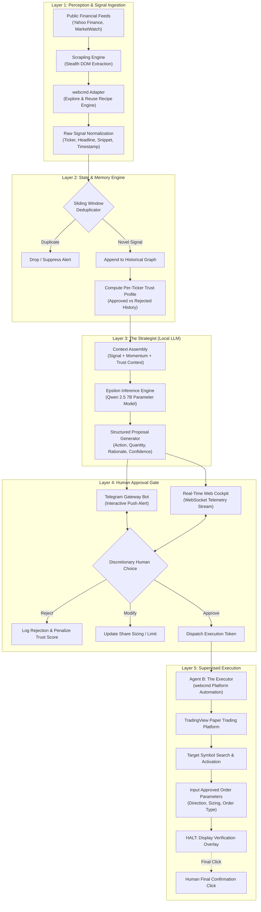
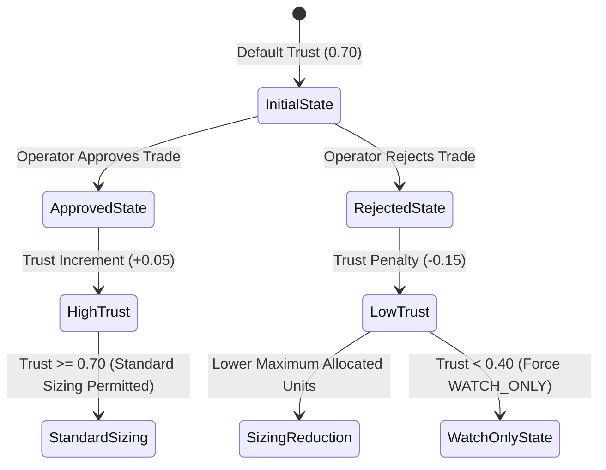
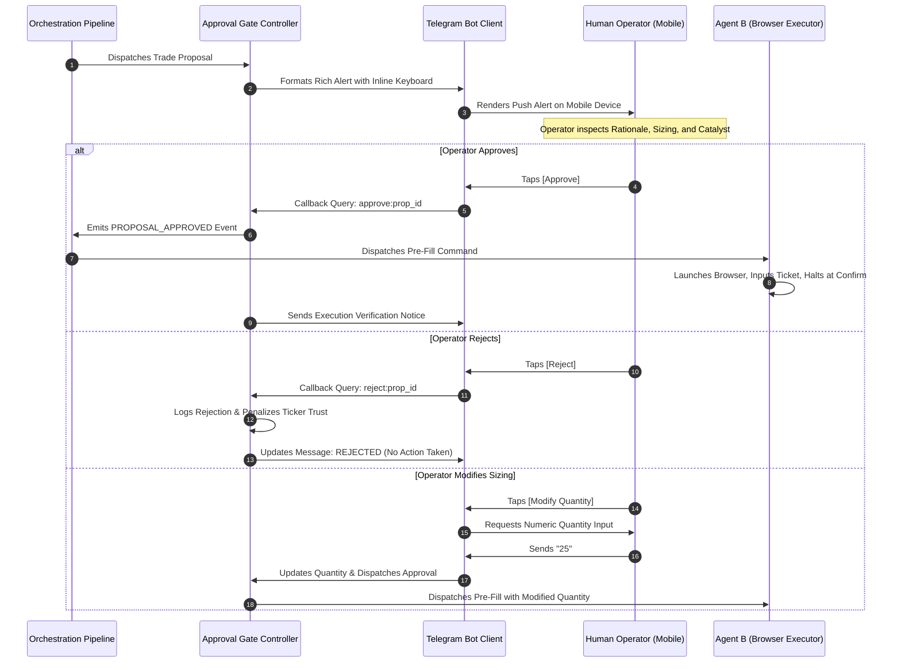
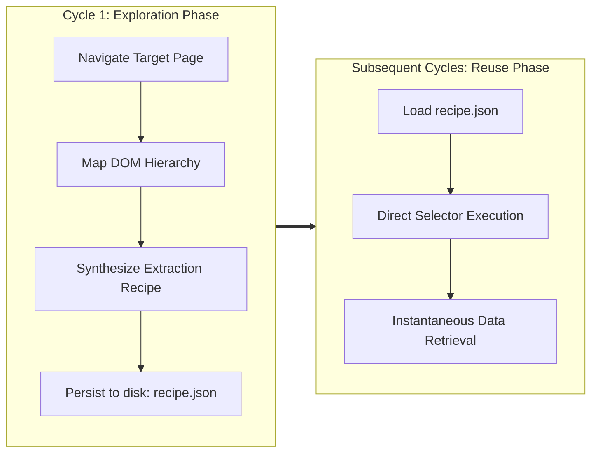

# StockSentinel

**A Self-Learning, Human-Gated Browser Agent Architecture for Market Analysis and Supervised Execution**

*Developed for the Self-Learning Agent Browser (SLAB) Hackathon @ MAIT — Hosted by webcmd*  
*Autonomous Perception · Local Reasoning via Qwen 2.5 7B · Human-Gated Execution via Telegram*

---

## 1. Abstract & Executive Summary

Retail and discretionary market participants face three compounding operational challenges:
1. **Information Velocity and Dispersion**: Crucial market-moving catalysts are fragmented across hundreds of disparate digital portals, feeds, and regulatory filing disclosures.
2. **Analysis Latency**: Synthesizing textual narrative into structured risk parameters (directional bias, sizing, technical confluence) under tight execution windows is cognitively demanding and prone to emotional bias.
3. **Execution Friction and Operational Risk**: Manually navigating platform interfaces, searching tickers, selecting order types, and setting sizing parameters introduces latency and execution error.

Fully autonomous algorithmic execution systems eliminate friction but introduce existential tail risk by eliminating human discretionary judgment from capital-allocating events. Such systems are vulnerable to LLM hallucinations, flash crashes, and regulatory infractions.

**StockSentinel** resolves this trade-off by establishing a bifurcated agentic boundary:
- **Tireless Autonomous Operations**: Continuous DOM ingestion, pattern mapping, signal extraction, historical memory deduplication, and local multi-factor reasoning are executed autonomously.
- **Strictly Supervised Execution**: The final capital-committing order submission is isolated behind an air-gapped **Human Approval Gate**. Orders are pre-filled on the execution platform via browser automation, but the final confirmation click remains strictly with the human operator.

```
"Watch tirelessly. Reason clearly. Prepare precisely. Act only on command."
```

---

## 2. System Architecture

The StockSentinel architecture comprises five synchronized components operating across an event-driven pipeline.



---

## 3. Subsystem Specifications

### 3.1 Agent A: The Watcher (Signal Ingestion & Pattern Learning)
Agent A continuously polls pre-configured financial news feeds and market aggregators for content relevant to the user's watchlist (`TSLA`, `NVDA`, `AAPL`, `MSFT`, `GOOGL`).

- **Stealth DOM Retrieval (Scrapling)**: Financial web portals employ sophisticated anti-bot fingerprinting and dynamic DOM hydration. Agent A utilizes Scrapling's specialized HTTP client and browser spoofing algorithms to retrieve full DOM representations in under 2,500 milliseconds without triggering rate limits or IP challenges.
- **Pattern Learning (webcmd)**: The retrieved DOM tree is evaluated against webcmd's recipe store. On first exposure, webcmd analyzes container structures and saves target selector hierarchies to persistent storage (`data/learned_commands/`). Subsequent polling cycles bypass exploratory DOM traversals, parsing items via pre-compiled extraction commands.
- **Signal Output Schema**:
```json
{
  "id": "sig_TSLA_1726119600000",
  "ticker": "TSLA",
  "headline": "Tesla expands European robotaxi pilot with formal regulatory clearance",
  "snippet": "Commercial rollout of autonomous robotaxis is ahead of schedule with European regulatory approvals progressing rapidly.",
  "source": "Yahoo Finance Top Market News",
  "timestamp": "2026-09-12T05:30:00.000Z",
  "raw_sentiment_hint": "positive"
}
```

---

### 3.2 Memory Layer: Deduplication & Trust Scoring
A stateless alert system creates user alert fatigue, causing operators to ignore critical signals. The StockSentinel Memory Layer enforces two stateful filters:

1. **Sliding-Window Deduplication**: Incoming headlines are normalized, stripped of non-alphanumeric noise, and hashed alongside ticker symbols (`ticker:clean_headline`). Any duplicate detected within a 2-hour window is suppressed.
2. **Bayesian-Inspired Trust Scoring**: The system maintains an ongoing record of user decisions per ticker symbol.



If a user repeatedly rejects proposals on a specific ticker, its trust score declines. This score is injected into the LLM context, instructing the reasoning engine to downgrade actionable signals to `watch_only` or reduce recommended quantities.

---

### 3.3 The Strategist: Local Reasoning Layer (Qwen 2.5 7B via Epsilon)
To ensure absolute data confidentiality and zero external API dependencies during live execution, reasoning is processed entirely on-device using **Qwen 2.5 7B** hosted through the **Epsilon Engine** (`./engine`).

- **Context Assembly**: The strategist merges the raw signal, technical sentiment heuristics, and the historical trust score into an instructional prompt.
- **Advisory Framing**: The system prompt explicitly enforces that the model is strictly an analytical advisor. It is prohibited from assuming autonomous authority.
- **Decision Engine Output**:
```json
{
  "ticker": "TSLA",
  "action": "buy",
  "suggested_quantity": 15,
  "confidence": "high",
  "rationale": "Strong positive catalyst with European regulatory approvals progressing ahead of schedule. Momentum indicates favorable risk/reward.",
  "source_signal_id": "sig_TSLA_1726119600000",
  "engine": "Local Qwen 2.5 7B"
}
```

---

### 3.4 Human Approval Gate: Telegram Integration
The Human Approval Gate is the operational centerpiece of StockSentinel. It provides direct, bi-directional command-and-control through an interactive Telegram Bot interface.



#### Interactive Command Matrix
| Command | Parameter | Functionality |
|---|---|---|
| `/start` | None | Initializes session and registers user Chat ID |
| `/status` | None | Displays active watchlist, reasoning engine status, and pending approvals |
| `/demo` | None | Generates an instantaneous live simulated proposal for verification |
| `/watchlist` | None | Lists all actively monitored tickers, names, sectors, and default caps |
| `/trust` | None | Renders visual trust score indicators and historical decision tallies |
| `/help` | None | Displays operational manual and interaction rules |
| Natural Query | Arbitrary Text | Natural language interpreter answering market questions and ticker status |

---

### 3.5 Agent B: The Executor (TradingView Paper Trading)
Agent B remains dormant until an approval token is dispatched by the Approval Gate.

- **Automation Technology**: Driven by webcmd browser automation primitives (using Puppeteer Core linked to installed Chromium/Edge binaries).
- **Workflow Operations**:
  1. Activates browser window and navigates to the target paper trading interface (`https://www.tradingview.com/chart/`).
  2. Traverses to the search interface and enters the target ticker symbol.
  3. Selects the verified directional ticket (`BUY` or `SELL`).
  4. Enters the exact approved share quantity.
  5. Injects an on-screen DOM verification banner confirming parameter alignment.
- **The Halt Boundary**: Agent B is architecturally restricted from interacting with the final submission element. It leaves the ticket open and focused, requiring the operator's physical click on the platform to route the order.

---

## 4. webcmd Sponsor Infrastructure Alignment

The hackathon guidelines explicitly prioritize the demonstrate-and-evaluate cycle of webcmd:

### 4.1 Exploration vs. Reuse Paradigm


- **Exploration Phase**: On initial execution, the agent executes full structural discovery, evaluating alternative selectors, determining optimal container anchors, and saving structured JSON recipes to `data/learned_commands/`.
- **Fast Reuse Phase**: On subsequent intervals, exploration overhead is bypassed entirely. The agent applies pre-compiled selector recipes, reducing cycle time from tens of seconds to under 2 seconds.

### 4.2 Self-Healing & Layout Shift Recovery
Web pages regularly update layouts, invalidate CSS classes, or alter DOM hierarchies. If a pre-learned recipe fails during execution:
1. Agent catches the selector mismatch exception.
2. Rather than crashing or silently aborting, the agent triggers an automated self-healing routine.
3. Exploration phase is re-engaged autonomously to map the modified DOM structure.
4. The updated recipe is saved as an incremented version (e.g., `v2`), restoring execution continuity.

---

## 5. Repository Structure

```
stocksentinel/
├── agents/
│   ├── agent_a_watcher/
│   │   ├── scrapling_fetch.py         # Undetected high-speed DOM retrieval engine
│   │   └── webcmd_news.js             # Agent A controller: explore, reuse, and signal extraction
│   ├── agent_b_executor/
│   │   └── webcmd_trade.js            # Agent B controller: TradingView order pre-fill automation
│   └── webcmd_adapter.js              # Core webcmd bridge: recipe storage, reuse, and self-healing
├── approval_gate/
│   ├── public/
│   │   └── index.html                 # Real-time WebSocket visual cockpit dashboard
│   ├── gate_logic.js                  # Central human-gate authority & event emitter
│   ├── server.js                      # Express API and WebSocket telemetry broadcaster
│   └── telegram_bot.js                # Bi-directional Telegram Bot integration
├── config/
│   ├── settings.js                    # Global system parameters, timeouts, and URLs
│   └── watchlist.js                   # Target tickers, sector definitions, and sizing bounds
├── data/
│   ├── learned_commands/              # Persistent webcmd recipe storage (explore artifacts)
│   └── memory.json                    # Knowledge store: signals, proposals, and trust metrics
├── engine/                            # Local Epsilon LLM engine directory
│   ├── backend/
│   │   ├── main.py                    # Epsilon engine entry point
│   │   └── tiers/model_manager.py     # Qwen 2.5 7B model lifecycle and process manager
│   └── config.yaml                    # Local engine tiered routing configuration
├── memory/
│   ├── dedup.js                       # Sliding-window signal deduplication engine
│   └── store.js                       # Knowledge graph manager for proposals and trust scoring
├── orchestration/
│   └── pipeline.js                    # Central event loop coordinating Agents A, Strategist, Gate, B
├── .env.example                       # Environment configuration template
├── index.js                           # Master application entry point
├── package.json                       # Project dependencies and script declarations
├── stocksentinel.md                   # Hackathon specification document
└── README.md                          # Comprehensive technical documentation
```

---

## 6. Installation & Configuration

### 6.1 Prerequisites
- **Node.js**: Version 18.0.0 or higher
- **Python**: Version 3.10 or higher
- **Browser**: Google Chrome or Microsoft Edge installed on system path

### 6.2 Step-by-Step Setup

1. **Clone the Repository**:
   ```bash
   git clone https://github.com/LovekeshAnand/stocksentinel.git
   cd stocksentinel
   ```

2. **Install Node.js Dependencies**:
   ```bash
   npm install
   ```

3. **Install Python Scraping & Browser Automation Libraries**:
   ```bash
   python -m pip install scrapling curl_cffi playwright patchright browserforge
   ```

4. **Configure Environment Variables**:
   Copy `.env.example` to `.env`:
   ```bash
   cp .env.example .env
   ```

5. **Set Configuration Parameters in `.env`**:
   ```env
   # Telegram Bot Token (obtained from @BotFather)
   TELEGRAM_BOT_TOKEN=your_telegram_bot_token_here
   TELEGRAM_CHAT_ID=

   # Local Epsilon LLM Engine Parameters
   EPSILON_ENGINE_PATH=./engine
   EPSILON_TIER=balanced
   EPSILON_TIMEOUT_MS=60000

   # Pipeline Orchestration
   POLL_INTERVAL_SEC=30
   PORT=3000
   PAPER_TRADING_URL=https://www.tradingview.com/chart/
   ```

6. **Initialize Telegram Connection**:
   - Open Telegram and initiate a conversation with your bot.
   - Send `/start` to bind your chat ID to the Approval Gate.

---

## 7. Execution & Operation

### 7.1 Starting the System
Launch the complete StockSentinel pipeline:
```bash
npm start
```

### 7.2 Accessing the Live Cockpit
Open a web browser to:
```
http://localhost:3000
```
The visual cockpit provides:
- Live status across all four operational tiers.
- Real-time display of pending human approvals synchronized via WebSockets.
- Streaming telemetry event log showing ingestion and reasoning milestones.
- Dynamic Memory & Trust Graph visualization showing historical approval ratios.
- **Trigger Live Demo Signal** button for instantaneous evaluation without waiting for external market news.

---

## 8. Live Demonstration Script (Evaluation Protocol)

### Stage 1: Problem Demonstration (20 Seconds)
- Illustrate the cognitive overhead of manually tracking news across multiple financial portals while simultaneously managing order entry screens.
- Emphasize the risk of fully autonomous bots that execute without discretionary human oversight.

### Stage 2: webcmd Perception & Fast Reuse (60 Seconds)
- Observe Agent A poll the market news source.
- Highlight the transition in telemetry logs from `[EXPLORE PHASE]` (initial DOM structural mapping) to `[REUSE PHASE]` (sub-2-second execution utilizing saved command recipes).
- Point to `data/learned_commands/read_financial_news.recipe.json` as the verified self-learning artifact.

### Stage 3: Supervised Execution via Telegram Gate (90 Seconds)
- Trigger a market catalyst alert (via `/demo` in Telegram or the web cockpit button).
- Show the incoming rich alert on the mobile Telegram client, complete with:
  - Ticker, directional action, and calculated share sizing.
  - Plain-English rationale generated by the local Qwen 2.5 7B model.
  - Interactive approval controls (`Approve`, `Reject`, `Modify`).
- Tap `Approve` on the mobile device.
- Observe Agent B immediately activate the paper trading interface, populate the ticker and quantity fields, and **visibly halt before the submit button**.
- Demonstrate the strict human boundary: the final submission click requires manual execution.

### Stage 4: Self-Learning Memory Feedback (30 Seconds)
- Reject a subsequent trade on `TSLA`.
- Display the Cockpit Trust Graph: show the trust score adjust downward, demonstrating stateful adaptation rather than stateless prompting.

---

## 9. Hackathon Hard Rules Compliance

| Hackathon Requirement | System Implementation & Evidence |
|---|---|
| **Built with webcmd** | webcmd is the core browser automation backbone for both Agent A (news exploration and reuse) and Agent B (order form automation). |
| **Human Approval for Sensitive Actions** | Fully enforced at the architectural level. No order is transmitted to execution without explicit approval via Telegram or Cockpit. |
| **Local / Independent Reasoning** | Powered entirely by on-device Qwen 2.5 7B through the Epsilon engine, requiring zero proprietary model APIs. |
| **Live Reliability & Robustness** | Scrapling bypasses anti-bot barriers; webcmd self-healing automatically recovers from DOM layout changes. |
| **Terms of Service Adherence** | Utilizes public read-only market feeds and standard interactive interfaces on simulated paper trading environments. |
